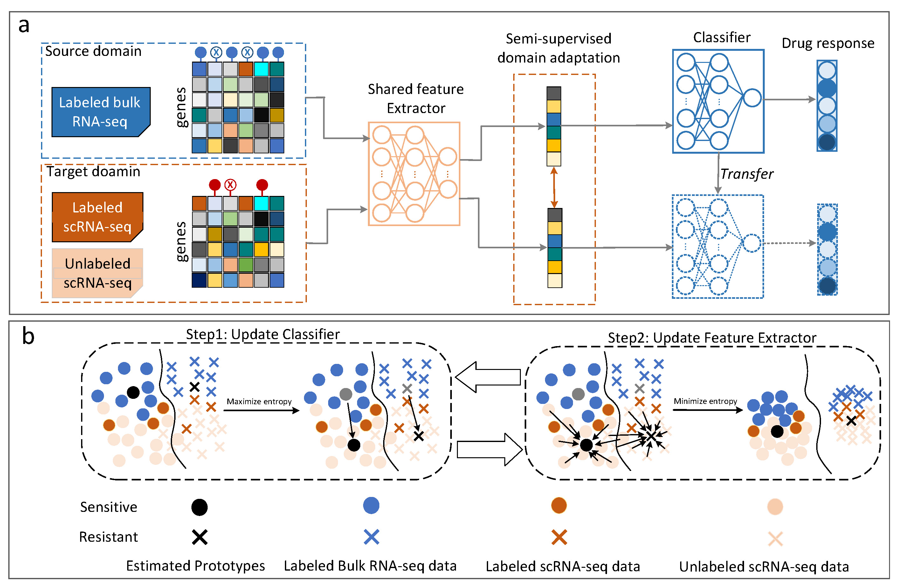

# Semi-supervised deep transfer learning accurately predicting single-cell drug responses

## Introduction

**SSDA4Drug** is a semi-supervised domain adaptation model for inferring single-cell drug response.

## Model architecture



## Requirements

The deep learning models were trained on 2*NVIDIA GeForce RTX 4090 on linux.

+ Python 3.9
+ PyTorch 2.1.0
+ Pandas 2.0.3
+ Numpy 1.24.3
+ Scikit-learn 1.3.1
+ Scanpy 1.9.5
+ Shap 0.45.1
+ Captum 0.7.0

## Usage

To setup the environment, install conda and run (Must run on servers with multiple GPUs):

```bash
conda create --name <your_env_name> --file requirements.txt
```

If you want to use benchmark data to train a model, please split the dataset
```bash
benchmark.ipynb
split_data.ipynb
n_shot.ipynb
```
then run
```bash
python main.py -shot_method "3-shot" -drug "Gefitinib" -encoder_h_dims "512,256" -bottleneck 128 -predictor_h_dims "64,32" -epochs 50 -lr 0.001 --batch_size 32 -dropout 0.3
```

if you want to train the model using other datasets, you need to download the datasets (Example: GDSC and GEO), place it in the datasets folder, and then run
```bash
python main.py -shot_method 3-shot
```

## Directory structure
+ `main.py/experiment_shot.py`: contains the code for the model, the dataset, the evaluation, and the training loop.

+ `trainer.py`: Contains the training loop, the hyperparameters, and the evaluation.

+ `utils.py`: Contains auxiliary, general-purpose, or custom functions, which can be called and used in other parts of the project.

+ `model.py`: Model storage directory.

+ `data`:
  * 'SCAD_data`：The directory stores the dataset of benchmark.
  * `experiment_data`: The directory stores the dataset of experiment.
